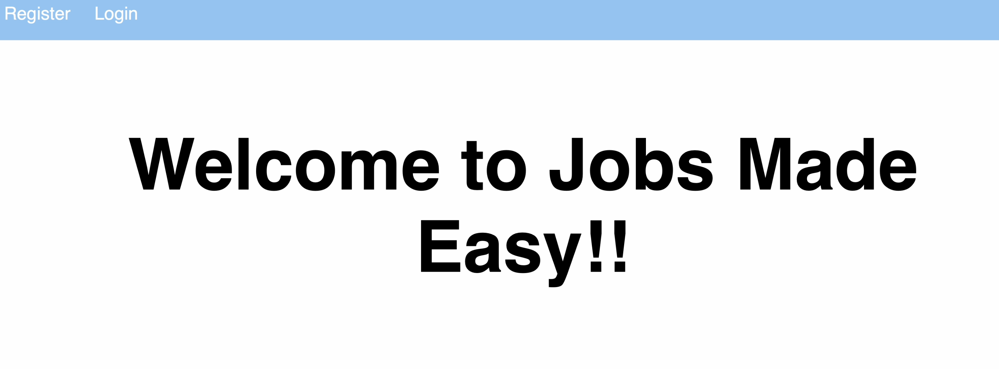
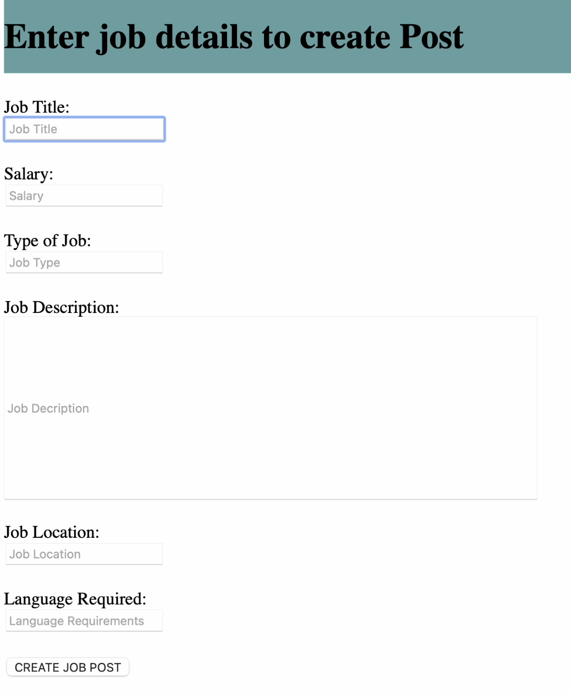
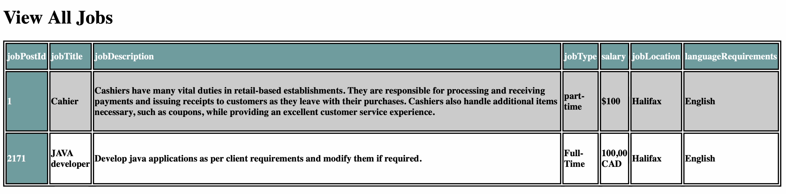
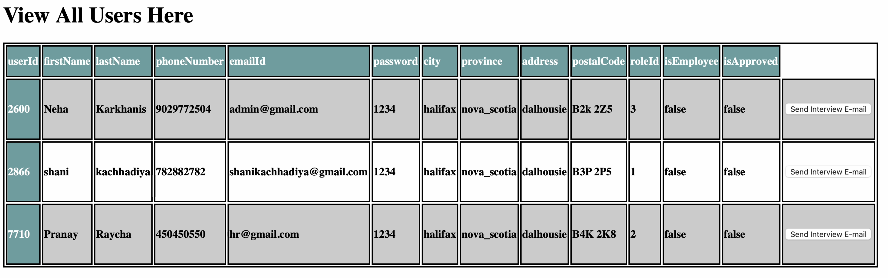
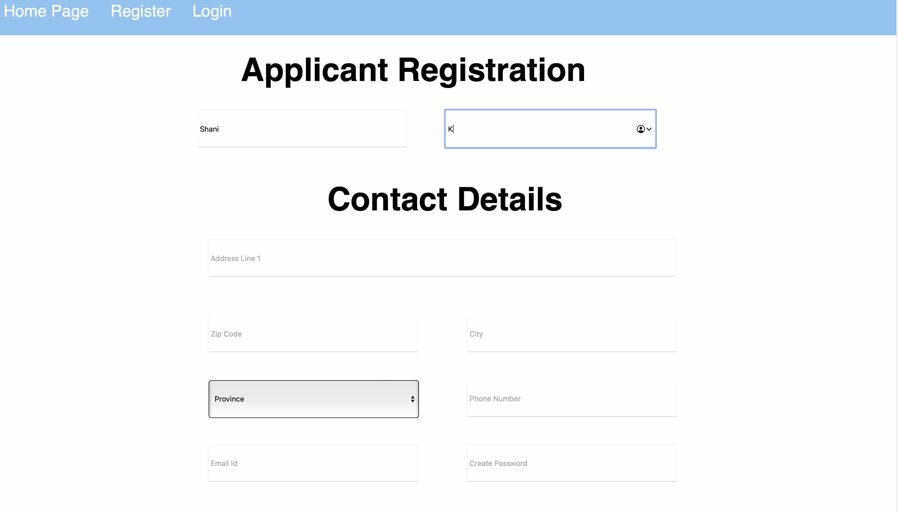
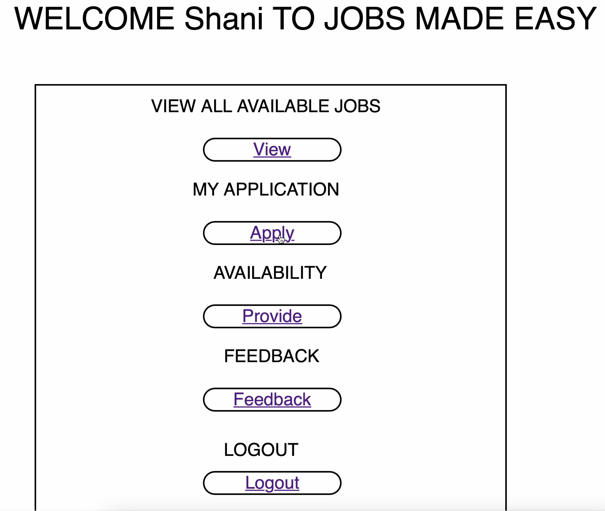
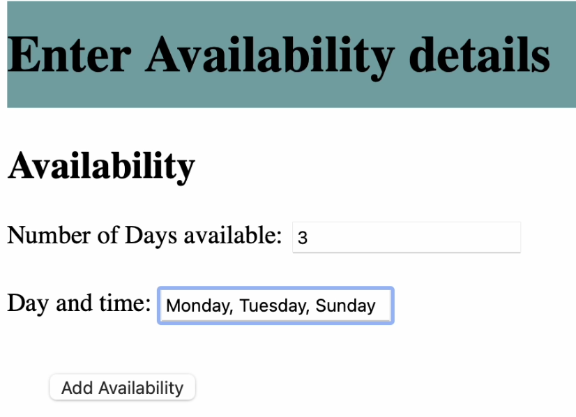
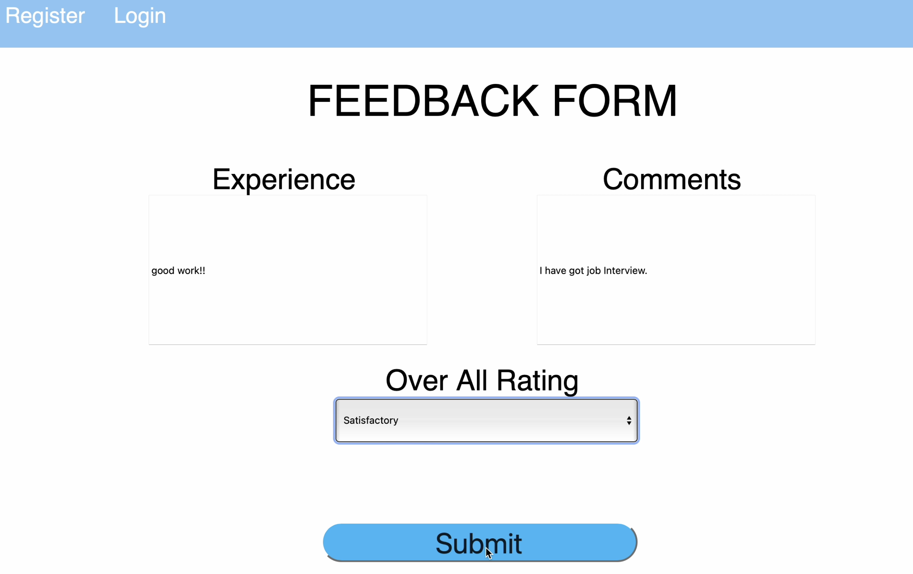

# Jobs Made Easy

Jobs Made Easy is a web application built using Java Spring Boot and HTML/CSS for the front end. I followed the Model-View-Controller (MVC) architectural pattern to organize the components. It streamlines the hiring process for part-time jobs for hiring managers and candidates, offering candidates to apply directly or based on availability. JobsMadeEasy is created following software development principles including Test Driven Development, SOLID Principles, Design Patterns, CI/CD, Software Development Lifecycle, and Agile Methodologies.

#

## User Interface

#

### Home page



#

### HR Dashboard


#

### Create Job Page



#

### View All Jobs



#

### View All Users



#

### Applicant Registration



#

### Applicant Home Page



#

### Enter Availability



#

### Give Feedback



#

# Getting Started

## How to run application

<br/>

The first step is to clone the repo in your machine.

Next, Change the directory to the JobsMadeEasy project folder using:

```
cd .\JobsMadeEasy
```

Next step is, ensure you have Java Development Kit (JDK) installed on your machine. You can download it from link given below:

```
https://www.oracle.com/java/technologies/javase-jdk14-downloads.html
```

Ensure Maven is installed on your machine. You can download it from the Apache Maven website:

```
https://maven.apache.org/download.cgi
```

Run the following command to build and install the dependencies using Maven:

```
mvn clean install
```

Run the following command to start the application:

```
mvn spring-boot:run
```

To access the web application, Open a web browser and access the application at http://localhost:8080.

#

# Modules

The application consists of the following modules:

1. **Authentication:**
   This module handles user authentication, including registration, login, and password management.

2. **Availability:**
   The availability module allows users to manage and update their availability for job applications.

3. **Database:**
   The database module is responsible for managing data storage, retrieval, and manipulation. This includes handling connections to the database and executing queries.

4. **Feedback:**
   This module allows users to submit feedback on various aspects of the platform, such as the job application process, user experience, or any issues they encounter.

5. **Job Application:**
   The job application module handles the process of applying for jobs, including submitting applications, tracking application statuses, and managing communication between job seekers and employers.

6. **Job Post:**
   The job post module allows employers to create, edit, and manage job postings. It also provides tools for searching and filtering job listings.

#

# Usage Instructions

Hiring Managers:

- HR can create job postings on this platform providing details such as title, location, requirements, and salary.
- They can see a list of all job postings created and delete them if no longer needed.
- A list of all applications for all job postings is also available for hiring managers so that they can select ideal candidates and send interview mail to them.

Applicants:

- Applicants can apply for jobs using two ways on this platform.
- One is to apply directly to the job postings, and another path is application based on availability.
- In the second way, all applicants can provide their availability directly regardless of job postings.
- Hiring managers will be given this availability information so they can directly employ applicants who meet their availability criteria.
